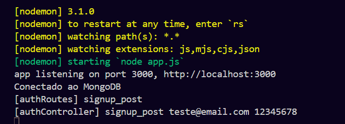

# P1_APLIC_HIBRID

## MÓDULOS NPM INSTALADOS

* bcrypt: 5.1.1
* express: 4.19.2
* jsonwebtoken: 9.0.2
* mongoose: 8.3.3
* validator: 13.11.0

## EXECUÇÃO

1. Instalação de dependências

   ```node
   npm install
   ```
2. Inicializar servidor construído no arquivo base `app.js`

   ```node
   npm run nodemon
   ```
3. Efetuar requisições (Testado com "POSTMAN")

   ```REQUEST
   http://localhost:3000
   ```
4. GET e POST funcionando para as rotas "login" e "signup"

   ```POST
   http://localhost:3000/signup
   ```

   ```post
   http://localhost:3000/login
   ```
5. Efetuar requisição em modo "Body", Formato "raw"

   
6. Utilizar a "email" e "password" para efetuar as requisições de acordo com o modelo abaixo

   ```
   {
       "email": "teste@email.com",
       "password": "12345678"
   }
   ```
7. Terminal deverá retornar com todas as requisições em formato de log e na requisição retorna o valor processado
   

   NOTA: Para fins de estudo, o terminal está reportando todas as operações, a versão final devera ser removido o log, assim como a chave de autenticação do MongoDB

   

   Token sendo retornado em tela para averiguar se está executando de maneira correta

   

   Token configurado

   
   Mongo está sendo executado corretamente e armazenou o usuário de acordo com o especificado em código

   

   Devido a manipulação aberta do banco pela extensão do "MongoDB", facilita a visualização do resultado e quais dados foram gravados
   

   Em caso de tentativa de cadastrar usuário ja existente, o código retorna na requisição com mensagem de erro
   

   Para finalidade de estudo, o terminal reporta ambas as respostas do servidor
   

## EXPLICAÇÃO


Aplicação básica construída efetuando a conexão com o banco utilizando mongoose, importações e estabelecimento do servidor na porta 3000.


Como estabelecido anteriormente na execução, todos os comandos executados estão retornando no terminal cada comando, mesmo que será removido ao ser preparado ao front-end.

A criação de cinco rotas básicas para operar as requisições, onde "signup" e "login" operam em pares para adquirir a informação cadastral que deverá ser retornada na interface pelo "GET" e "POST"


Neste segmento, importamos o "Mongoose" para efetuar a conexão com o banco de dados e cadastrar email e senha dos usuários, onde o módulo "bcrypt" armazena a senha em Hash e garante  que seja mais seguro armazenar as senhas. Os parâmetros obrigatórios especificados foram: Email como entrada que não pode se repetir, a senha deve conter mais de oito caracteres, além de ambos os campos serem obrigatórios a serem preenchidos.

O módulo "validator" serve o proposito de gerenciar a validação e erros relacionados ao formato de email, exemplo: Emails que não contem @ na composição.

"userSchema" define a estrutura que o banco de dados deverá seguir, assim como tratamento de erros com os formulário.


Seguimento dedicado a aplicação do "JWT" em conjunto a importação do "User" que está se comunicando ao banco de dados fornecendo a estrutura.

"requireAuth" para efetuar a criação e autenticação do token "JWT" ao verificar a chave secreta se bate com o cadastro do usuário para evitar fraude na manipulação de dados.

"checkUser" funciona em seguida verificando as credencias fornecidas estão de acordo com o token e os dados armazenados em banco, em caso de falha no login ele retornara "nulo" e o usuários não será autenticado.


Por ultimo, herdando as configurações de "User" e "jwt" e configurando as informações tratadas e recebidas pelas rotas, tratando possíveis erros que podem ser mostrados ao usuário durante a execução da aplicação com front-end implementado.

Começando com o tratamento de erros, configurados para exibir no terminal em conjunto com as requisições realizadas e no desenvolvimento fornecer uma visão maior dos possíveis erros.

"login_post" e "signup_post" estão cuidando das credenciais de usuário e seu token de validação, caso falhe em alguma etapa, será relatado pelo tratamento de erros. Recebendo os dados de credenciais e validando para enviar a resposta ao servidor de acordo, caso o usuário ão tenha cadastro, poderá ser encaminhado a efetuar cadastro, ou se possue conta cadastrada, redirecionar a efetuação de login.
